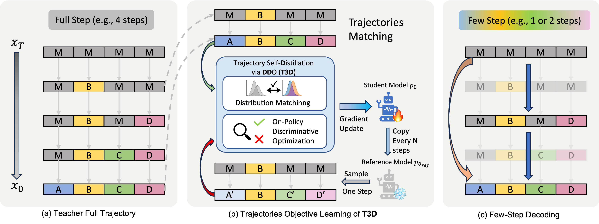

# T3D: Trajectory Self-Distillation via Direct Discriminative Optimization
This repo is the official implementation of **T3D: Trajectory Self-Distillation via Direct Discriminative Optimization**. 
## Overview

**T3D** (Trajectory Self-Distillation via Direct Discriminative Optimization) is a trajectory self-distillation framework designed to enable **high-quality few-step inference** for Diffusion Large Language Models (DLLMs).

While DLLMs provide strong potential for parallel token generation, they often suffer from severe quality degradation when the number of denoising steps is aggressively reduced.
T3D addresses this challenge by distilling **on-policy generative trajectories** from the model itself, significantly narrowing the performance gap between few-step and full-step decoding.

---

## Key Ideas
- **Label-Free Training:** Learns entirely from self-generated trajectories without external labels.

- **Trajectory Self-Distillation:** Distills on-policy teacher rollouts to reduce train–test mismatch.

- **Direct Discriminative Optimization:** Uses reverse-KL-style optimization to focus on high-probability teacher modes.

---

## Installation

### 1. Environment Setup

```bash
conda create -n dllm python=3.10
conda activate dllm
```

### 2. Install Dependencies

```bash
pip install torch==2.6.0
pip install -r requirements.txt
conda install -c nvidia cuda
```

### 3. (Optional) Configure Cache Directory

Useful when using NVMe or shared memory for faster Triton / Torch extension compilation.

```bash
export T3D_CACHE_ROOT=/path/to/cache   # default: ~/.cache/t3d
```

---

## Data Preparation

Place dataset JSON files under:

```
data/
```

Example:

```
data/MATH_train.json
```

You can download datasets using:

```bash
cd data
python download_data.py --dataset MATH_train
python download_data.py --dataset MATH500
cd ..
```

---

## Workflow

The training pipeline consists of three stages:

1. Rollout trajectory generation
2. Trajectory preprocessing
3. T3D training

---

## Stage 1 — Rollout (Trajectory Generation)

Run from the `sample/` directory.

Default behavior:

* Input data: `../data/`
* Output trajectories: `../<experiment.project>/temp_data/`

```bash
cd sample

python sdar_sample.py config=../configs/sdar_sample.yaml \
    evaluation.eval_dataset=MATH_train \
    evaluation.data_type=math \
    rollout.block_size=4 \
    rollout.denoising_steps_per_block=4 \
    rollout.max_token=2000 \
    rollout.temperature=0.1 \
    rollout.top_p=1.0 \
    rollout.top_k=0 \
    rollout.remasking_strategy="low_confidence_static"

cd ..
```

---

## Stage 2 — Preprocess Trajectories

Move rollout file into `data/`:

```bash
mv path/to/rollouts.json data/SDAR-4B-Chat-MATH_train.json
```

Then preprocess:

```bash
cd data
python rename_key.py --model_name SDAR-4B-Chat --dataset MATH_train
cd ..
```

---

## Stage 3 — Training (T3D)

### (Optional) W&B Login

```bash
wandb login
```

### Launch Training

```bash
accelerate launch \
  --num_machines 1 \
  --machine_rank 0 \
  --main_process_ip 127.0.0.1 \
  --main_process_port 8889 \
  --config_file accelerate_configs/1_node_8_gpus_deepspeed_zero1.yaml \
  train/self_ddo_sdar_full.py \
  config=configs/ddo_sdar_full_self.yaml
```

Outputs → `experiments/`

Training data location:

```
data/<config.dataset.optimization_data>.json
```

---

## Checkpoint

We provide a [checkpoint](https://huggingface.co/Tyrion279/SDAR-4B-Chat-t3d-math): SDAR-4B-Chat trained with T3D on MATH_train:

---

## Evaluation

Modify:

```
configs/eval.yaml
```

Then run:

```bash
python eval.py config=configs/eval.yaml \
    evaluation.checkpoint_path=/path/to/checkpoint \
    evaluation.eval_dataset=MATH500 \
    evaluation.data_type=math \
    rollout.block_size=4 \
    rollout.denoising_steps_per_block=1 \
    rollout.temperature=0.1
```
---

## Configuration Guide

| Component  | Config File                       |
| ---------- | --------------------------------- |
| Rollout    | `configs/sdar_sample.yaml`        |
| Training   | `configs/ddo_sdar_full_self.yaml` |
| Multi-GPU  | `accelerate_configs/`             |
| Evaluation | `configs/eval.yaml`               |

---

## Troubleshooting: CUDA / Compilation Issues

If compilation fails, try:

```bash
export CUDA_HOME="$CONDA_PREFIX"
export CUDACXX="$CONDA_PREFIX/bin/nvcc"

export PATH="$CONDA_PREFIX/bin:$PATH"
export CPATH="$CONDA_PREFIX/include:$CPATH"

export LD_LIBRARY_PATH="$CONDA_PREFIX/lib:$CONDA_PREFIX/lib64:$LD_LIBRARY_PATH"
export LD_LIBRARY_PATH=/usr/lib/x86_64-linux-gnu:$LD_LIBRARY_PATH

export LIBRARY_PATH=/usr/lib/x86_64-linux-gnu:$LIBRARY_PATH
```
# License
The code is released under the MIT License.